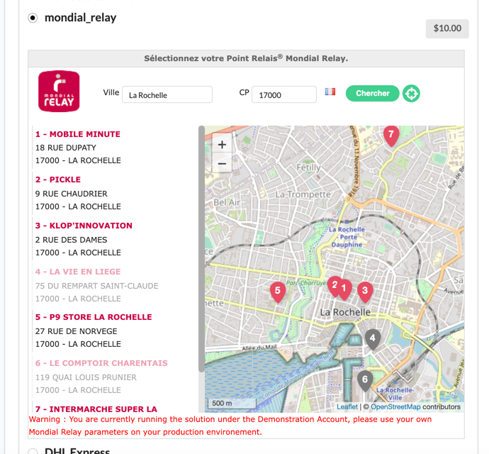
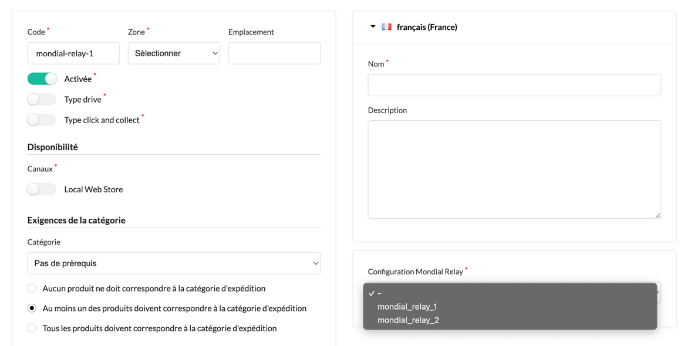

## Explanation

#### The goal is to easily integrate this map inside your select shipping workflow 

## Quickstart Installation

1. Run `composer require wishibam/sylius-mondial-relay-plugin`

## Usage

1. Create the config file `config/packages/wishibam_sylius_mondial_relay.yaml`. Full configuration [example here](https://github.com/Wishibam/sylius-mondial-relay/blob/master/tests/Application/config/packages/wishibam_sylius_mondial_relay.yaml)
2. Override the sylius template `@SyliusShop/Checkout/SelectShipping/_shipment.html.twig`
```html

```
3. Create a new shipping method in admin, and select a configuration (leave it blank if not Mondial Relay):



## Requirements

- You should have [leaflet](https://leafletjs.com/) available inside your javascript. 
- **Or** you can use the google map (configure `map.type = google` and `map.googleApiKey = 'xxxx'`). The plugin will require the google map automatically for you. Not tested, feel free to open an issue ! 

### Configuration 

Full [configuration](https://github.com/Wishibam/sylius-mondial-relay/blob/master/tests/Application/config/packages/wishibam_sylius_mondial_relay.yaml) example

### Running plugin tests

  - PHPUnit

    ```bash
    vendor/bin/phpunit
    ```

  - PHPSpec

    ```bash
    vendor/bin/phpspec run
    ```

  - Behat (non-JS scenarios)

    ```bash
    vendor/bin/behat --strict --tags="~@javascript"
    ```

  - Behat (JS scenarios)
 
    1. [Install Symfony CLI command](https://symfony.com/download).
 
    2. Start Headless Chrome:
    
      ```bash
      google-chrome-stable --enable-automation --disable-background-networking --no-default-browser-check --no-first-run --disable-popup-blocking --disable-default-apps --allow-insecure-localhost --disable-translate --disable-extensions --no-sandbox --enable-features=Metal --headless --remote-debugging-port=9222 --window-size=2880,1800 --proxy-server='direct://' --proxy-bypass-list='*' http://127.0.0.1
      ```
    
    3. Install SSL certificates (only once needed) and run test application's webserver on `127.0.0.1:8080`:
    
      ```bash
      symfony server:ca:install
      APP_ENV=test symfony server:start --port=8080 --dir=tests/Application/public --daemon
      ```
    
    4. Run Behat:
    
      ```bash
      vendor/bin/behat --strict --tags="@javascript"
      ```
    
  - Static Analysis
  
    - Psalm
    
      ```bash
      vendor/bin/psalm
      ```
      
    - PHPStan
    
      ```bash
      vendor/bin/phpstan analyse -c phpstan.neon -l max src/  
      ```

  - Coding Standard
  
    ```bash
    vendor/bin/ecs check src
    ```

### Opening Sylius with your plugin

- Using `test` environment:

    ```bash
    (cd tests/Application && APP_ENV=test bin/console sylius:fixtures:load)
    (cd tests/Application && APP_ENV=test bin/console server:run -d public)
    ```
    
- Using `dev` environment:

    ```bash
    (cd tests/Application && APP_ENV=dev bin/console sylius:fixtures:load)
    (cd tests/Application && APP_ENV=dev bin/console server:run -d public)
    ```


2. From the root directory, run the following commands:

    ```bash
    $ (cd tests/Application && yarn install)
    $ (cd tests/Application && yarn build)
    $ (cd tests/Application && APP_ENV=test bin/console assets:install public)
    
    $ (cd tests/Application && APP_ENV=test bin/console doctrine:database:create)
    $ (cd tests/Application && APP_ENV=test bin/console doctrine:schema:create)
    ```

⚠⚠⚠
To be able to setup a plugin's database, remember to configure you database credentials in `tests/Application/.env` and `tests/Application/.env.test`.
⚠⚠⚠
